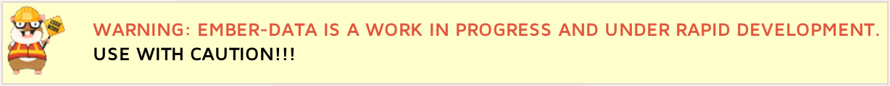

# ember-rails  [](http://travis-ci.org/emberjs/ember-rails) [](https://gemnasium.com/emberjs/ember-rails)

ember-rails allows you to include [Ember.JS](http://emberjs.com/) into your Rails 3.1+ application.

The gem will also pre-compile your handlebars templates when building your asset pipeline. It includes development and production copies of Ember.

You can see an example of how to use the gem [here](https://github.com/keithpitt/ember-rails-example). There is also a great tutorial by [Dan Gebhardt](https://twitter.com/#!/dgeb) called "[Beginning Ember.js on Rails](http://www.cerebris.com/blog/2012/01/24/beginning-ember-js-on-rails-part-1/)" which is a great read if you're just starting out with Rails and Ember.js

## Getting started

Add the gems to your application Gemfile:

```ruby
gem 'ember-rails'
gem 'ember-source', '1.0.0rc3.3' # or the version you need
gem 'handlebars-source', '1.0.0rc4' # or the version you need
```

Run `bundle install` and use the ember-rails generator to add the necessary dependencies.

Ember-rails will use the production build of Ember.js when Rails is running in
production mode, and the development build otherwise.

## Setting Ember Variant

After running `bundle install` make sure you set the ember variant for your enviroments in their respected files with.

    config.ember.variant = :development # or :production

Not doing so will result in Sprockets not being able to resolve Ember's dependencies.


## Architecture

Ember does not require an organized file structure. However, ember-rails allows you
to use `rails g ember:bootstrap` to create the following directory structure under `app/assets/javascripts`:

    controllers/
    helpers/
    models/
    routes/
    templates/
    views/

Additionally, it will add the following lines to `app/assets/javascripts/application.js`.
By default, it uses the Rails Application's name and creates an `rails_app_name.js`
file to setup application namespace and initial requires:

    //= require handlebars
    //= require ember
    //= require ember-data
    //= require_self
    //= require rails_app_name
    RailsAppName = Ember.Application.create();

*Example:*

    rails g ember:bootstrap
      insert  app/assets/javascripts/application.js
      create  app/assets/javascripts/models
      create  app/assets/javascripts/models/.gitkeep
      create  app/assets/javascripts/controllers
      create  app/assets/javascripts/controllers/.gitkeep
      create  app/assets/javascripts/views
      create  app/assets/javascripts/views/.gitkeep
      create  app/assets/javascripts/helpers
      create  app/assets/javascripts/helpers/.gitkeep
      create  app/assets/javascripts/templates
      create  app/assets/javascripts/templates/.gitkeep
      create  app/assets/javascripts/app.js

If you want to avoid `.gitkeep` files, use the `skip git` option like
this: `rails g ember:bootstrap -g`.

_(CoffeeScript support: just make sure you have `gem 'coffee-rails'` in your application Gemfile.)_

Ask Rails to serve HandlebarsJS and pre-compile templates to Ember
by putting each template in a dedicated ".js.hjs", ".hbs" or ".handlebars" file
(e.g. `app/assets/javascripts/templates/admin_panel.handlebars`)
and including the assets in your layout:

    <%= javascript_include_tag "templates/admin_panel" %>

If you want to strip template root from template names, add `templates_root` option to your application configuration block.
By default, `templates_root` is `'templates'`.

    config.handlebars.templates_root = 'ember_templates'

If you store templates in a file like `app/assets/javascripts/ember_templates/admin_panel.handlebars` after setting the above config,
it will be made available to Ember as the `admin_panel` template.

_(Note: you must clear the local sprockets cache after modifying `templates_root`, stored by default in `tmp/cache/assets`)_

Default behavior for ember-rails is to precompile handlebars templates.
If you don't want this behavior you can turn it off in your application configuration (or per environment in: `config/environments/development.rb`) block:

    config.handlebars.precompile = false

_(Note: you must clear the local sprockets cache if you disable precompilation, stored by default in `tmp/cache/assets`)_

Bundle all templates together thanks to Sprockets,
e.g create `app/assets/javascripts/templates/all.js` with:

    //= require_tree .

Now a single line in the layout loads everything:

    <%= javascript_include_tag "templates/all" %>

If you use Slim or Haml templates, you can use handlebars filter :

    handlebars:
        {{#view Ember.Button}}OK{{/view}}

It will be translated as :

    <script type="text/x-handlebars">
        {{#view Ember.Button}}OK{{/view}}
    </script>

## Specifying Different Versions of Ember/Handlebars/Ember-Data


By default, ember-rails ships with the latest version of
[Ember](https://rubygems.org/gems/ember-source/versions),
[Handlebars](https://rubygems.org/gems/handlebars-source/versions),
and [Ember-Data](https://rubygems.org/gems/ember-data-source/versions).

To specify a different version that'll be used for both template
precompilation and serving to the browser, you can specify the desired
version of one of the above-linked gems in the Gemfile, e.g.:

    gem 'ember-source', '1.0.0.pre4.2'

You can also specify versions of 'handlebars-source' and
'ember-data-source', but note that an appropriate 'handlebars-source'
will be automatically chosen depending on the version of 'ember-source'
that's specified.

You can also override the specific ember.js, handlebars.js, and
ember-data.js files that'll be `require`d by the Asset pipeline by
placing these files in `vendor/assets/ember/development` and
`vendor/assets/ember/production`, depending on the `config.ember.variant`
you've specified in your app's configuration, e.g.:

    config.ember.variant = :production
    #config.ember.variant = :development

## Updating Ember

If at any point you need to update Ember.js from master, you can do that with

    rails generate ember:install --head

This will clone both Ember.js and Ember Data from GitHub, build it and copy to the right directory.

## Note on Patches/Pull Requests

1. Fork the project.
2. Make your feature addition or bug fix.
3. Add tests for it. This is important so I don't break it in a future version unintentionally.
4. Commit, do not mess with rakefile, version, or history. (if you want to have your own version, that is fine but bump version in a commit by itself I can ignore when I pull)
5. Send me a pull request. Bonus points for topic branches.
